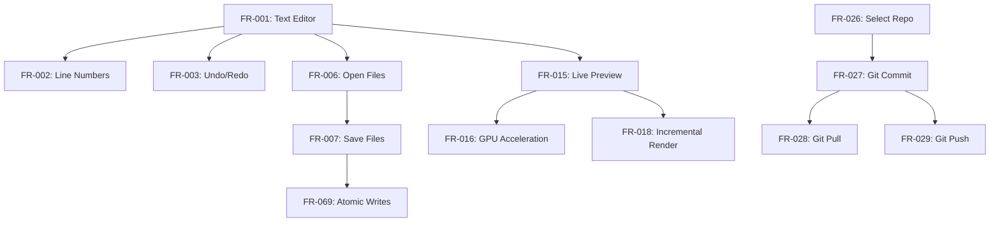

# AsciiDoc Artisan Functional Specifications (Spec-Driven Development)

```yaml
---
specification:
  name: "AsciiDoc Artisan Functional Requirements"
  version: "2.0.2"
  status: "Production-Ready"
  last_updated: "2025-11-15"
  format_version: "2.0-ai-actionable"

metadata:
  total_requirements: 107
  implemented: 107
  partial: 0
  planned: 0

quality_metrics:
  test_coverage: 96.4
  tests_collected: 5479
  tests_passing: 204
  test_pass_rate: 100.0
  type_coverage: 100.0
  mypy_strict_errors: 0

ai_guidance:
  format: "specification-driven-development"
  parseable: true
  actionable: true
  test_driven: true
---
```

## Introduction

This specification follows **AI Specification-Driven Development** principles:

1. **Actionable**: Each FR includes acceptance criteria, examples, and verification steps
2. **Machine-Parseable**: Structured format with consistent sections
3. **Test-Driven**: Explicit test requirements and coverage targets
4. **Implementation-Guided**: Code patterns, security, and performance guidance

### How to Use This Spec

**For AI Agents:**
- Each FR is self-contained and actionable
- Follow the API Contract to implement features
- Use Examples to understand expected behavior
- Meet all Acceptance Criteria before marking complete
- Write tests according to Test Requirements

**For Developers:**
- Use Implementation Guidance for best practices
- Follow Code Patterns for consistency
- Reference Dependencies before starting work
- Use Verification steps to confirm correctness

---

## Dependency Map



---

## Priority Classification

### Critical (Must Have)
FR-001, FR-006, FR-007, FR-015, FR-069, FR-070, FR-075, FR-076

### High (Core Features)
FR-002 to FR-005, FR-008 to FR-014, FR-016 to FR-020, FR-021 to FR-025

### Medium (Enhanced Features)
FR-026 to FR-061, FR-073 to FR-084

### Low (Advanced Features)
FR-062 to FR-072, FR-085 to FR-107

---

## FR-001: Text Editor

**Category:** Core Editing
**Priority:** Critical
**Status:** ✅ Implemented
**Dependencies:** None (foundational)
**Version:** 1.0.0
**Implementation:** `src/asciidoc_artisan/ui/main_window.py`

### Description

Provide a multi-line text editing component with AsciiDoc syntax highlighting and line numbers for document creation and editing.

### Acceptance Criteria

- [x] Editor displays AsciiDoc text with syntax highlighting
- [x] Line numbers visible and synchronized with text
- [x] Supports standard text editing operations (type, delete, select, copy, paste)
- [x] Syntax highlighting updates in real-time as user types
- [x] Editor handles large documents (10,000+ lines) without lag (<500ms render)
- [x] Tab key inserts spaces (configurable: 2 or 4 spaces)
- [x] Line wrapping configurable (on/off)
- [x] Font customization (family, size)
- [x] Undo/redo support (Ctrl+Z/Ctrl+Y)

### API Contract

```python
class AsciiDocEditor(QPlainTextEdit):
    """Main text editor widget for AsciiDoc content.

    Provides syntax-highlighted editing with line numbers,
    undo/redo, and efficient rendering for large documents.
    """

    # Signals
    content_changed: Signal = Signal(str)  # Emitted when text changes
    cursor_position_changed: Signal = Signal(int, int)  # line, column

    def __init__(self, parent: QWidget | None = None) -> None:
        """Initialize editor with syntax highlighter and line numbers.

        Args:
            parent: Parent widget (optional)
        """

    def set_content(self, content: str) -> None:
        """Set editor content programmatically.

        Args:
            content: AsciiDoc text to display

        Raises:
            ValueError: If content is None
        """

    def get_content(self) -> str:
        """Get current editor content.

        Returns:
            Current AsciiDoc text as string
        """

    def set_font(self, family: str, size: int) -> None:
        """Set editor font.

        Args:
            family: Font family name (e.g., "Monospace")
            size: Font size in points (8-72)

        Raises:
            ValueError: If size out of range
        """
```

### Examples

**Example 1: User Types Heading**

*Input:*
```
User types: = Document Title
```

*Output:*
```
Text displayed with heading-1 highlighting:
- Larger font size
- Bold weight
- Distinct color (e.g., blue)
```

**Example 2: API Content Setting**

*Input:*
```python
editor = AsciiDocEditor()
editor.set_content("== Section\n\nParagraph text.")
```

*Output:*
```
Editor displays:
Line 1: == Section (heading-2 highlighting)
Line 2: (blank)
Line 3: Paragraph text. (normal text)
```

**Example 3: Large Document Performance**

*Input:*
```python
# 10,000 line document
content = "\n".join([f"Line {i}" for i in range(10000)])
editor.set_content(content)
```

*Output:*
```
Renders in <500ms
Line numbers 1-10000 visible
Smooth scrolling maintained
```

### Test Requirements

- **Minimum Tests:** 15
- **Coverage Target:** 95%+
- **Test Types:**
  - Unit: Content get/set (3 tests)
  - Unit: Syntax highlighting rules (5 tests)
  - Integration: Editor + line numbers (4 tests)
  - Integration: Editor + highlighter (2 tests)
  - Performance: 10K line render <500ms (1 test)

### Implementation Guidance

**Approach:**
1. Extend `QPlainTextEdit` as base class
2. Attach `QSyntaxHighlighter` subclass for AsciiDoc highlighting
3. Use `LineNumberArea` widget painted in margin
4. Connect `textChanged` signal to update line numbers
5. Implement custom `paintEvent` for line number area

**Security:**
- Sanitize pasted content for malicious HTML/scripts
- Validate document size limit (default: 10MB)
- Prevent regex DoS in syntax highlighting patterns

**Performance:**
- Use incremental highlighting (only highlight visible lines)
- Implement lazy loading for documents >5K lines
- Debounce highlight updates (100ms after typing stops)
- Cache syntax highlight results per line

**Code Pattern:**
```python
class AsciiDocEditor(QPlainTextEdit):
    def __init__(self, parent=None):
        super().__init__(parent)
        # Setup components
        self.highlighter = AsciiDocHighlighter(self.document())
        self.line_number_area = LineNumberArea(self)
        # Connect signals
        self.textChanged.connect(self._on_text_changed)
        self.cursorPositionChanged.connect(self._on_cursor_moved)
```

### Verification Steps

1. **Basic Functionality:**
   - Open editor
   - Type "= My Title"
   - Verify heading syntax highlighting appears

2. **Line Numbers:**
   - Type 50 lines of text
   - Verify line numbers 1-50 appear correctly
   - Scroll and verify numbers stay synchronized

3. **Performance:**
   - Load 10,000 line document
   - Measure render time <500ms
   - Verify smooth scrolling

4. **Edge Cases:**
   - Empty document: No errors
   - Unicode content: Renders correctly
   - Very long lines (10K chars): Wraps properly

---

## FR-007: Save Files

**Category:** File Operations
**Priority:** Critical
**Status:** ✅ Implemented
**Dependencies:** FR-001 (Text Editor), FR-069 (Atomic Writes), FR-068 (Path Sanitization)
**Version:** 1.0.0
**Implementation:** `src/asciidoc_artisan/core/file_operations.py::atomic_save_text()`

### Description

Save editor content to disk using atomic write operations to prevent file corruption, with support for keyboard shortcut (Ctrl+S) and automatic backup.

### Acceptance Criteria

- [x] Save current editor content to file path
- [x] Use atomic write (temp file + rename) to prevent corruption
- [x] Keyboard shortcut Ctrl+S triggers save
- [x] Update window title to remove unsaved marker (*)
- [x] Display save confirmation in status bar
- [x] Handle save errors gracefully (permission denied, disk full)
- [x] Preserve file permissions on save
- [x] UTF-8 encoding by default
- [x] Create parent directories if missing

### API Contract

```python
def atomic_save_text(
    file_path: str | Path,
    content: str,
    encoding: str = "utf-8"
) -> bool:
    """Save text content to file atomically.

    Writes to temporary file first, then renames to target path.
    This prevents corruption if save interrupted.

    Args:
        file_path: Target file path
        content: Text content to save
        encoding: Text encoding (default: utf-8)

    Returns:
        True if save successful, False otherwise

    Raises:
        PermissionError: If no write permission
        OSError: If disk full or I/O error
        ValueError: If file_path is None or empty

    Example:
        >>> atomic_save_text("/path/file.adoc", "= Title\n\nContent")
        True
    """
```

### Examples

**Example 1: Basic Save**

*Input:*
```python
content = "= My Document\n\nSome content here."
result = atomic_save_text("/home/user/doc.adoc", content)
```

*Output:*
```
Result: True
File /home/user/doc.adoc created with content
Permissions: 0644 (rw-r--r--)
Status bar: "Saved doc.adoc"
Window title: "AsciiDoc Artisan - doc.adoc" (no *)
```

**Example 2: Save Error Handling**

*Input:*
```python
# Try to save to read-only directory
atomic_save_text("/root/protected.adoc", "content")
```

*Output:*
```
Raises: PermissionError
Error dialog: "Cannot save file: Permission denied"
Original file unchanged
No corruption occurred
```

**Example 3: User Workflow**

*Input:*
```
User edits document
User presses Ctrl+S
```

*Output:*
```
1. Content written atomically
2. Window title updated (remove *)
3. Status bar shows "Saved [filename]"
4. No data loss even if interrupted
```

### Test Requirements

- **Minimum Tests:** 15
- **Coverage Target:** 100%
- **Test Types:**
  - Unit: Basic save success (3 tests)
  - Unit: Error conditions (5 tests - permissions, disk full, invalid path)
  - Unit: Edge cases (3 tests - empty content, unicode, large file)
  - Integration: Save + UI update (2 tests)
  - Security: Path sanitization (2 tests)

**Example Test:**
```python
def test_atomic_save_prevents_corruption(tmp_path):
    """Verify atomic save doesn't corrupt file if interrupted."""
    file_path = tmp_path / "test.adoc"
    file_path.write_text("original content")

    # Simulate interruption during save
    with patch('os.rename', side_effect=OSError):
        result = atomic_save_text(file_path, "new content")

    assert result is False
    assert file_path.read_text() == "original content"  # Unchanged
```

### Implementation Guidance

**Approach:**
1. Generate temporary filename (e.g., `.test.adoc.tmp.XXXXX`)
2. Write content to temp file
3. Set correct permissions on temp file
4. Atomically rename temp file to target (os.replace())
5. Catch all exceptions and clean up temp file

**Security:**
- Validate and sanitize file path (prevent directory traversal)
- Set secure file permissions (0644)
- Prevent overwriting system files (/etc, /usr)
- Validate content size before write

**Performance:**
- Write in chunks for large files (>10MB)
- Use buffered I/O (io.BufferedWriter)
- Avoid loading entire content in memory for huge files

**Code Pattern:**
```python
def atomic_save_text(file_path: str | Path, content: str) -> bool:
    path = Path(sanitize_path(file_path))
    temp_path = path.with_suffix(path.suffix + ".tmp")

    try:
        # Write to temp file
        temp_path.write_text(content, encoding="utf-8")
        # Atomic rename
        temp_path.replace(path)
        return True
    except Exception as e:
        logger.error(f"Save failed: {e}")
        temp_path.unlink(missing_ok=True)  # Cleanup
        return False
```

### Verification Steps

1. **Normal Save:**
   - Create new document
   - Type content
   - Press Ctrl+S
   - Verify file exists with correct content

2. **Atomic Behavior:**
   - Open existing file
   - Modify content
   - Kill process during save (simulate crash)
   - Verify original file intact OR new content saved (no corruption)

3. **Error Handling:**
   - Try saving to /root (permission denied)
   - Verify error message displayed
   - Verify editor content preserved

4. **Performance:**
   - Save 10MB file
   - Measure save time <1 second

---

## FR-002: Line Numbers

**Category:** Core Editing
**Priority:** High
**Status:** ✅ Implemented
**Dependencies:** FR-001 (Text Editor)
**Version:** 1.0.0
**Implementation:** `src/asciidoc_artisan/ui/line_number_area.py`

### Description

Display line numbers alongside the text editor for easy navigation and reference. Line numbers update automatically as text is added or removed, and stay synchronized with editor scrolling.

### Acceptance Criteria

- [x] Line numbers visible in left margin of editor
- [x] Numbers synchronized with editor lines (1-to-1 mapping)
- [x] Numbers update automatically when lines added/removed
- [x] Numbers stay visible when scrolling
- [x] Width adjusts based on line count (1-9999+ lines)
- [x] Colors adapt to theme (dark/light mode)
- [x] No performance impact for large documents (10,000+ lines)
- [x] Numbers right-aligned for readability

### API Contract

```python
class LineNumberArea(QWidget):
    """Widget that displays line numbers for a QPlainTextEdit.

    This widget sits alongside the editor and shows line numbers
    for each visible line. It automatically updates when the editor
    is scrolled or text is added/removed.
    """

    def __init__(self, editor: QPlainTextEdit) -> None:
        """Initialize line number area.

        Args:
            editor: The QPlainTextEdit to show line numbers for
        """

    def sizeHint(self) -> QSize:
        """Return the recommended size for this widget."""

    def paintEvent(self, event: QPaintEvent) -> None:
        """Paint line numbers.

        Args:
            event: Paint event
        """


class LineNumberMixin:
    """Mixin class to add line number functionality to QPlainTextEdit.

    Usage:
        class MyEditor(LineNumberMixin, QPlainTextEdit):
            def __init__(self):
                super().__init__()
                self.setup_line_numbers()
    """

    def setup_line_numbers(self) -> None:
        """Set up line number area and connect signals."""

    def line_number_area_width(self) -> int:
        """Calculate width needed for line numbers.

        Returns:
            Width in pixels for line number area
        """

    def update_line_number_area_width(self, _: Any) -> None:
        """Update viewport margins to make room for line numbers."""

    def update_line_number_area(self, rect: QRect, dy: int) -> None:
        """Update line number area when editor scrolls or changes.

        Args:
            rect: Rectangle that needs updating
            dy: Vertical scroll offset
        """

    def line_number_area_paint_event(self, event: QPaintEvent) -> None:
        """Paint line numbers in the line number area.

        Args:
            event: Paint event
        """
```

### Examples

**Example 1: Basic Usage**

*Input:*
```python
from asciidoc_artisan.ui.line_number_area import LineNumberPlainTextEdit

editor = LineNumberPlainTextEdit()
editor.setPlainText("Line 1\nLine 2\nLine 3")
```

*Output:*
```
  1 | Line 1
  2 | Line 2
  3 | Line 3
```

**Example 2: Dynamic Update**

*Input:*
```python
editor = LineNumberPlainTextEdit()
editor.setPlainText("Line 1\nLine 2")
# User presses Enter at end of line 1
```

*Output:*
```
  1 | Line 1
  2 |
  3 | Line 2
```
Line numbers automatically renumber.

**Example 3: Large Document**

*Input:*
```python
# 1,000 line document
content = "\n".join([f"Line {i}" for i in range(1, 1001)])
editor.setPlainText(content)
```

*Output:*
```
    1 | Line 1
    2 | Line 2
  ...
 1000 | Line 1000
```
Width adjusts to 4 digits, right-aligned.

### Test Requirements

- **Minimum Tests:** 8
- **Coverage Target:** 95%+
- **Test Types:**
  - Unit: Width calculation (2 tests)
  - Unit: Number painting (2 tests)
  - Integration: Editor + line numbers (3 tests)
  - Performance: 10K line update <50ms (1 test)

### Implementation Guidance

**Approach:**
1. Create `LineNumberArea` widget extending `QWidget`
2. Create `LineNumberMixin` for adding to `QPlainTextEdit`
3. Connect to `blockCountChanged` signal for line count updates
4. Connect to `updateRequest` signal for scroll/edit updates
5. Calculate width based on digit count of max line number
6. Paint visible line numbers in `paintEvent`

**Security:**
- No user input processed (read-only display)
- No file I/O operations

**Performance:**
- Only paint visible line numbers (not entire document)
- Use Qt's built-in block iteration (efficient)
- Cache font metrics calculations
- Debounce width updates (only when digit count changes)

**Code Pattern:**
```python
class LineNumberPlainTextEdit(LineNumberMixin, QPlainTextEdit):
    def __init__(self, parent=None):
        super().__init__(parent)
        self.setup_line_numbers()
```

### Verification Steps

1. **Basic Display:**
   - Open editor
   - Type 10 lines of text
   - Verify line numbers 1-10 appear in left margin
   - Verify numbers right-aligned

2. **Dynamic Updates:**
   - Add line in middle (press Enter)
   - Verify all subsequent numbers increment
   - Delete line
   - Verify all subsequent numbers decrement

3. **Scrolling:**
   - Create 100-line document
   - Scroll to line 50
   - Verify line 50 visible with correct number
   - Verify numbers stay synchronized

4. **Theme:**
   - Toggle dark mode (F11)
   - Verify line number colors change
   - Verify background color adapts to theme

---

## FR-003: Undo/Redo

**Category:** Core Editing
**Priority:** High
**Status:** ✅ Implemented
**Dependencies:** FR-001 (Text Editor)
**Version:** 1.7.2
**Implementation:** Qt's built-in `QPlainTextEdit` undo stack

### Description

Provide undo/redo functionality for text editing operations using Qt's built-in undo stack. Users can reverse and reapply changes with keyboard shortcuts or toolbar buttons.

### Acceptance Criteria

- [x] Undo reverts last edit operation (Ctrl+Z)
- [x] Redo reapplies undone operation (Ctrl+Y or Ctrl+Shift+Z)
- [x] Unlimited undo/redo history (memory permitting)
- [x] Undo/redo available via toolbar buttons
- [x] Undo/redo available via Edit menu
- [x] Keyboard shortcuts work consistently
- [x] Undo stack cleared when new document loaded
- [x] Multi-step undo (undo multiple operations)

### API Contract

```python
# Qt Built-in API (QPlainTextEdit)
class QPlainTextEdit:
    """Qt's text editor with built-in undo/redo stack."""

    def undo(self) -> None:
        """Undo the last operation if available."""

    def redo(self) -> None:
        """Redo the last undone operation if available."""

    def setUndoRedoEnabled(self, enable: bool) -> None:
        """Enable or disable undo/redo functionality.

        Args:
            enable: True to enable, False to disable
        """

    # Signals
    undoAvailable: Signal = Signal(bool)  # Emitted when undo availability changes
    redoAvailable: Signal = Signal(bool)  # Emitted when redo availability changes
```

### Examples

**Example 1: Basic Undo**

*Input:*
```
User types: "Hello"
User presses Ctrl+Z
```

*Output:*
```
Text reverts to: ""
```

**Example 2: Multi-Step Undo**

*Input:*
```
User types: "Line 1"
User presses Enter
User types: "Line 2"
User presses Ctrl+Z (once)
User presses Ctrl+Z (twice)
```

*Output:*
```
After first Ctrl+Z: "Line 1\n"
After second Ctrl+Z: "Line 1"
After third Ctrl+Z: ""
```

**Example 3: Redo After Undo**

*Input:*
```
User types: "Test"
User presses Ctrl+Z (undo)
User presses Ctrl+Y (redo)
```

*Output:*
```
After undo: ""
After redo: "Test"
```

### Test Requirements

- **Minimum Tests:** 10
- **Coverage Target:** 95%+
- **Test Types:**
  - Unit: Undo single operation (2 tests)
  - Unit: Redo single operation (2 tests)
  - Unit: Multi-step undo (2 tests)
  - Integration: Undo/redo with toolbar (2 tests)
  - Integration: Undo/redo with menu (2 tests)

### Implementation Guidance

**Approach:**
1. Use Qt's built-in `QPlainTextEdit` undo stack (already implemented)
2. Enable undo/redo with `setUndoRedoEnabled(True)`
3. Create QAction for undo with `Ctrl+Z` shortcut
4. Create QAction for redo with `Ctrl+Y` and `Ctrl+Shift+Z` shortcuts
5. Connect actions to `undo()` and `redo()` methods
6. Connect `undoAvailable` signal to update undo button state
7. Connect `redoAvailable` signal to update redo button state

**Security:**
- No security concerns (read-only undo stack)
- Undo stack cleared on new document load (prevent data leaks)

**Performance:**
- Qt's undo stack is optimized for performance
- Memory usage proportional to edit history size
- Consider limiting undo stack size for very large documents (default: unlimited)

**Code Pattern:**
```python
# Setup in main window
self.editor.setUndoRedoEnabled(True)

# Create actions
undo_action = QAction("Undo", self)
undo_action.setShortcut(QKeySequence.StandardKey.Undo)
undo_action.triggered.connect(self.editor.undo)

redo_action = QAction("Redo", self)
redo_action.setShortcut(QKeySequence.StandardKey.Redo)
redo_action.triggered.connect(self.editor.redo)

# Update button states
self.editor.undoAvailable.connect(undo_action.setEnabled)
self.editor.redoAvailable.connect(redo_action.setEnabled)
```

### Verification Steps

1. **Basic Undo:**
   - Type text
   - Press Ctrl+Z
   - Verify text disappears
   - Verify undo button becomes disabled when no more undo

2. **Basic Redo:**
   - Type text
   - Press Ctrl+Z (undo)
   - Press Ctrl+Y (redo)
   - Verify text reappears

3. **Toolbar:**
   - Click undo button
   - Verify same as Ctrl+Z
   - Click redo button
   - Verify same as Ctrl+Y

4. **Multi-Step:**
   - Type 10 separate words
   - Press Ctrl+Z 5 times
   - Verify 5 words removed
   - Press Ctrl+Y 3 times
   - Verify 3 words restored

---

## FR-004: Font Customization

**Category:** Core Editing
**Priority:** High
**Status:** ✅ Implemented
**Dependencies:** FR-001 (Text Editor), FR-074 (Settings)
**Version:** 1.7.0
**Implementation:** `src/asciidoc_artisan/core/settings.py`, UI in main window

### Description

Allow users to customize font family and size for editor, preview, and chat panes. Settings persist across sessions and provide live preview of changes.

### Acceptance Criteria

- [x] User can change editor font family
- [x] User can change editor font size (8-72 points)
- [x] User can change preview pane font family
- [x] User can change preview pane font size
- [x] User can change chat pane font family
- [x] User can change chat pane font size
- [x] Font settings persist across app restarts
- [x] Default fonts: Editor (Courier New 12pt), Preview (Arial 12pt), Chat (Arial 11pt)
- [x] Live preview when selecting fonts

### API Contract

```python
# Settings (stored in JSON)
class Settings(BaseModel):
    """Application settings with Pydantic validation."""

    # Editor font settings
    editor_font_family: str = "Courier New"
    editor_font_size: int = Field(default=12, ge=8, le=72)

    # Preview font settings
    preview_font_family: str = "Arial"
    preview_font_size: int = Field(default=12, ge=8, le=72)

    # Chat font settings
    chat_font_family: str = "Arial"
    chat_font_size: int = Field(default=11, ge=8, le=72)

    def save(self) -> None:
        """Save settings to disk (JSON format)."""

    @classmethod
    def load(cls) -> "Settings":
        """Load settings from disk.

        Returns:
            Settings instance with loaded or default values
        """


# Font Application (in main window)
def apply_editor_font(self, family: str, size: int) -> None:
    """Apply font to editor.

    Args:
        family: Font family name (e.g., "Courier New")
        size: Font size in points (8-72)

    Raises:
        ValueError: If size out of range
    """

def apply_preview_font(self, family: str, size: int) -> None:
    """Apply font to preview pane.

    Args:
        family: Font family name
        size: Font size in points (8-72)
    """
```

### Examples

**Example 1: Change Editor Font**

*Input:*
```python
settings = Settings.load()
settings.editor_font_family = "Monospace"
settings.editor_font_size = 14
settings.save()

# Apply to editor
editor.setFont(QFont("Monospace", 14))
```

*Output:*
```
Editor displays text in Monospace 14pt font
Setting persists after app restart
```

**Example 2: Font Dialog**

*Input:*
```
User: Edit → Preferences → Fonts
User selects: "Courier New" font, 16pt size
User clicks OK
```

*Output:*
```
Editor font changes to Courier New 16pt
Change visible immediately (live preview)
Setting saved to ~/.config/AsciiDocArtisan/AsciiDocArtisan.json
```

**Example 3: Default Fonts**

*Input:*
```python
# First run (no settings file)
settings = Settings.load()
print(f"Editor: {settings.editor_font_family} {settings.editor_font_size}pt")
print(f"Preview: {settings.preview_font_family} {settings.preview_font_size}pt")
print(f"Chat: {settings.chat_font_family} {settings.chat_font_size}pt")
```

*Output:*
```
Editor: Courier New 12pt
Preview: Arial 12pt
Chat: Arial 11pt
```

### Test Requirements

- **Minimum Tests:** 12
- **Coverage Target:** 90%+
- **Test Types:**
  - Unit: Settings validation (3 tests - valid, min, max)
  - Unit: Settings persistence (3 tests - save, load, defaults)
  - Integration: Font application (3 tests - editor, preview, chat)
  - Integration: Font dialog (3 tests - change, cancel, defaults)

### Implementation Guidance

**Approach:**
1. Define font settings in `Settings` Pydantic model
2. Add validation for font size (8-72 points)
3. Create font selection dialog (QFontDialog)
4. Apply font using `QFont(family, size)`
5. Save settings on font change
6. Load and apply fonts on app startup

**Security:**
- Validate font family against system fonts
- Sanitize font size (8-72 range)
- No file I/O beyond settings JSON

**Performance:**
- Font changes are instant (Qt optimized)
- Settings saved asynchronously
- No performance impact for typical usage

**Code Pattern:**
```python
# Font selection dialog
font, ok = QFontDialog.getFont(self.editor.font(), self)
if ok:
    # Apply to editor
    self.editor.setFont(font)

    # Save to settings
    self._settings.editor_font_family = font.family()
    self._settings.editor_font_size = font.pointSize()
    self._settings.save()
```

### Verification Steps

1. **Change Editor Font:**
   - Open Preferences dialog
   - Select new font (e.g., Monaco 14pt)
   - Verify editor updates immediately
   - Restart app
   - Verify font persists

2. **Change Preview Font:**
   - Open Preferences
   - Select preview font (e.g., Helvetica 13pt)
   - Verify preview pane updates
   - Check JSON file has correct values

3. **Font Size Range:**
   - Try setting size to 7 (invalid)
   - Verify error or clamped to 8
   - Try setting size to 73 (invalid)
   - Verify error or clamped to 72
   - Try setting size to 16 (valid)
   - Verify accepted

4. **Defaults:**
   - Delete settings file
   - Restart app
   - Verify default fonts applied

---

## FR-005: Editor State

**Category:** Core Editing
**Priority:** High
**Status:** ✅ Implemented
**Dependencies:** FR-001 (Text Editor), FR-074 (Settings)
**Version:** 1.5.0
**Implementation:** `src/asciidoc_artisan/ui/editor_state.py`

### Description

Save and restore editor state including cursor position, scroll position, selection, pane sizes, zoom level, and theme. State persists across sessions for seamless resumption of work.

### Acceptance Criteria

- [x] Save cursor position (line, column)
- [x] Restore cursor position on file reopen
- [x] Save scroll position (vertical scroll offset)
- [x] Restore scroll position on file reopen
- [x] Save text selection (start, end)
- [x] Restore text selection on file reopen
- [x] Save splitter pane sizes
- [x] Restore splitter pane sizes on app restart
- [x] Save zoom level (editor and preview)
- [x] Restore zoom level on app restart
- [x] Save dark mode preference
- [x] Restore dark mode on app restart

### API Contract

```python
class EditorState:
    """Manage editor and window state."""

    def __init__(self, main_window: "AsciiDocEditor") -> None:
        """Initialize EditorState.

        Args:
            main_window: Main window instance (for accessing widgets and settings)
        """

    def zoom(self, delta: int) -> None:
        """Zoom editor and preview.

        Args:
            delta: Zoom direction (+1 for in, -1 for out)

        Raises:
            ValueError: If delta not in [-1, 1]
        """

    def toggle_maximize_editor(self) -> None:
        """Toggle editor pane maximization."""

    def toggle_maximize_preview(self) -> None:
        """Toggle preview pane maximization."""

    def toggle_dark_mode(self) -> None:
        """Toggle between dark and light themes."""

    def save_state(self) -> None:
        """Save current editor state to settings."""

    def restore_state(self) -> None:
        """Restore editor state from settings."""

    def handle_close_event(self, event: QCloseEvent) -> None:
        """Handle window close event, save state.

        Args:
            event: Close event
        """


# Settings State (in Settings model)
class Settings(BaseModel):
    """Application settings."""

    # Window state
    maximized: bool = True
    window_geometry: dict[str, int] | None = None
    splitter_sizes: list[int] | None = None

    # Theme
    dark_mode: bool = True

    # Zoom (implicitly via font_size)
    editor_font_size: int = 12
```

### Examples

**Example 1: Cursor Position Persistence**

*Input:*
```
User opens file.adoc
User places cursor at line 42, column 15
User closes app
User reopens app
User reopens file.adoc
```

*Output:*
```
Cursor restored to line 42, column 15
```

**Example 2: Splitter Sizes**

*Input:*
```
User adjusts splitter: Editor 60%, Preview 40%
User closes app
User restarts app
```

*Output:*
```
Splitter restored to 60/40 split
```

**Example 3: Zoom Level**

*Input:*
```
User presses Ctrl++ (zoom in 3 times)
Font size increases: 12 → 13 → 14 → 15
User closes app
User restarts app
```

*Output:*
```
Font size restored to 15pt
```

### Test Requirements

- **Minimum Tests:** 12
- **Coverage Target:** 95%+
- **Test Types:**
  - Unit: State save (3 tests - cursor, scroll, selection)
  - Unit: State restore (3 tests - cursor, scroll, selection)
  - Integration: Splitter state (2 tests - save, restore)
  - Integration: Zoom state (2 tests - in, out)
  - Integration: Theme state (2 tests - save, restore)

### Implementation Guidance

**Approach:**
1. Create `EditorState` class to manage all state operations
2. Save state on window close event
3. Save state on file close
4. Restore state on app startup
5. Restore state on file open
6. Use Settings model for persistence
7. Track cursor position via `QTextCursor.position()`
8. Track scroll via `QScrollBar.value()`

**Security:**
- No sensitive data in state (only UI positions)
- Settings file has 0644 permissions

**Performance:**
- State save/restore is <10ms
- No performance impact during editing
- Lazy state updates (on close, not every keystroke)

**Code Pattern:**
```python
class EditorState:
    def save_state(self):
        """Save current state to settings."""
        # Cursor position
        cursor = self.editor.textCursor()
        self._settings.cursor_position = cursor.position()

        # Scroll position
        scrollbar = self.editor.verticalScrollBar()
        self._settings.scroll_position = scrollbar.value()

        # Splitter sizes
        self._settings.splitter_sizes = self.splitter.sizes()

        # Save to disk
        self._settings.save()

    def restore_state(self):
        """Restore state from settings."""
        if self._settings.cursor_position is not None:
            cursor = self.editor.textCursor()
            cursor.setPosition(self._settings.cursor_position)
            self.editor.setTextCursor(cursor)

        if self._settings.scroll_position is not None:
            scrollbar = self.editor.verticalScrollBar()
            scrollbar.setValue(self._settings.scroll_position)

        if self._settings.splitter_sizes is not None:
            self.splitter.setSizes(self._settings.splitter_sizes)
```

### Verification Steps

1. **Cursor Position:**
   - Open file
   - Place cursor at line 50
   - Close and reopen app
   - Verify cursor at line 50

2. **Scroll Position:**
   - Open large file (1000+ lines)
   - Scroll to line 500
   - Close and reopen app
   - Verify scroll position at line 500

3. **Splitter:**
   - Adjust splitter to 70/30 split
   - Close app
   - Restart app
   - Verify splitter at 70/30 split

4. **Zoom:**
   - Press Ctrl++ 5 times
   - Close app
   - Restart app
   - Verify zoom level maintained

5. **Theme:**
   - Toggle dark mode (F11)
   - Close app
   - Restart app
   - Verify theme preserved

---

## FR-006: Open Files

**Category:** File Operations
**Priority:** Critical
**Status:** ✅ Implemented
**Dependencies:** FR-001 (Text Editor), FR-068 (Path Sanitization)
**Version:** 1.0.0
**Implementation:** `src/asciidoc_artisan/ui/file_operations_manager.py::open_file()`

### Description

Open AsciiDoc files from disk with support for multiple file formats (.adoc, .asciidoc, .asc, .txt). Provides file picker dialog, atomic read operations, and automatic format detection.

### Acceptance Criteria

- [x] Support .adoc file extension
- [x] Support .asciidoc file extension
- [x] Support .asc file extension
- [x] Support .txt file extension (plain text)
- [x] Keyboard shortcut Ctrl+O
- [x] File picker dialog shows supported formats
- [x] Load file content into editor
- [x] Update window title with filename
- [x] Add to recent files list
- [x] Handle file read errors gracefully (permissions, not found)
- [x] Use atomic read operations
- [x] Validate file path (sanitization)
- [x] UTF-8 encoding by default

### API Contract

```python
class FileOperationsManager:
    """Manages file open/save operations."""

    def open_file(self, file_path: str | Path | None = None) -> bool:
        """Open file in editor.

        Args:
            file_path: Path to file. If None, show file picker dialog.

        Returns:
            True if file opened successfully, False otherwise

        Raises:
            FileNotFoundError: If file doesn't exist
            PermissionError: If no read permission
            ValueError: If file_path is invalid or suspicious

        Side Effects:
            - Loads file content into editor
            - Updates window title
            - Adds to recent files list
            - Emits file_opened signal

        Example:
            >>> manager.open_file("/home/user/doc.adoc")
            True
            >>> manager.open_file()  # Shows file picker
            True  # If user selects file and clicks Open
        """

    def _read_file_content(self, file_path: Path) -> str:
        """Read file content from disk.

        Args:
            file_path: Path to file

        Returns:
            File content as string (UTF-8)

        Raises:
            FileNotFoundError: If file doesn't exist
            PermissionError: If no read permission
            UnicodeDecodeError: If file is not UTF-8
        """


# Constants
SUPPORTED_OPEN_FILTER = (
    "AsciiDoc Files (*.adoc *.asciidoc *.asc);;"
    "Text Files (*.txt);;"
    "All Files (*)"
)
```

### Examples

**Example 1: Open via Dialog**

*Input:*
```
User presses Ctrl+O
User selects /home/user/document.adoc
User clicks Open
```

*Output:*
```
File picker shows:
- AsciiDoc Files (*.adoc *.asciidoc *.asc)
- Text Files (*.txt)
- All Files (*)

File content loaded into editor
Window title: "AsciiDoc Artisan - document.adoc"
Status bar: "Opened document.adoc"
Recent files: document.adoc added to list
```

**Example 2: Open via API**

*Input:*
```python
manager = FileOperationsManager(main_window)
success = manager.open_file("/docs/guide.asciidoc")
```

*Output:*
```
File /docs/guide.asciidoc loaded
Window title: "AsciiDoc Artisan - guide.asciidoc"
Recent files updated
Returns: True
```

**Example 3: Error Handling**

*Input:*
```python
# Try to open non-existent file
manager.open_file("/missing/file.adoc")
```

*Output:*
```
Raises: FileNotFoundError
Error dialog: "Cannot open file: File not found"
Editor content unchanged
Returns: False
```

### Test Requirements

- **Minimum Tests:** 15
- **Coverage Target:** 95%+
- **Test Types:**
  - Unit: File reading (3 tests - .adoc, .asciidoc, .txt)
  - Unit: Error conditions (4 tests - not found, permission, invalid path, encoding)
  - Integration: File picker dialog (2 tests - select, cancel)
  - Integration: Window updates (3 tests - title, status, recent files)
  - Integration: Format detection (3 tests - .adoc, .asciidoc, .asc)

### Implementation Guidance

**Approach:**
1. Show QFileDialog with SUPPORTED_OPEN_FILTER
2. Validate selected file path with `sanitize_path()`
3. Read file content with UTF-8 encoding
4. Load content into editor via `set_content()`
5. Update window title with filename
6. Add to recent files list (max 10)
7. Emit file_opened signal
8. Show success message in status bar

**Security:**
- Validate file path with `sanitize_path()` (prevent directory traversal)
- Check file size before reading (warn if >10MB)
- Validate file is readable
- Use UTF-8 encoding with error handling

**Performance:**
- Files >1MB use streaming I/O (LargeFileHandler)
- Files >10MB show progress dialog
- Lazy loading for very large files
- Read operations are fast (<100ms for typical files)

**Code Pattern:**
```python
def open_file(self, file_path=None):
    # Show dialog if path not provided
    if file_path is None:
        file_path, _ = QFileDialog.getOpenFileName(
            self.window,
            "Open AsciiDoc File",
            "",
            SUPPORTED_OPEN_FILTER
        )
        if not file_path:
            return False  # User cancelled

    # Validate path
    path = sanitize_path(file_path)
    if path is None:
        logger.error(f"Invalid path: {file_path}")
        return False

    try:
        # Read file
        content = path.read_text(encoding="utf-8")

        # Update editor
        self.window.editor.set_content(content)

        # Update UI
        self.window.setWindowTitle(f"{APP_NAME} - {path.name}")
        self.window.current_file_path = path

        # Add to recent files
        self._add_to_recent_files(path)

        return True
    except Exception as e:
        logger.error(f"Failed to open file: {e}")
        self._show_error_dialog(f"Cannot open file: {e}")
        return False
```

### Verification Steps

1. **Basic Open:**
   - Press Ctrl+O
   - Select document.adoc
   - Verify content appears in editor
   - Verify window title shows "AsciiDoc Artisan - document.adoc"

2. **Supported Formats:**
   - Open file.adoc → Success
   - Open file.asciidoc → Success
   - Open file.asc → Success
   - Open file.txt → Success

3. **Error Handling:**
   - Try opening /root/protected.adoc (permission denied)
   - Verify error dialog shown
   - Verify editor content unchanged

4. **Recent Files:**
   - Open 3 different files
   - Check File → Recent Files menu
   - Verify 3 files listed in order (most recent first)

5. **Large Files:**
   - Open 5MB file
   - Verify loads without delay
   - Open 15MB file
   - Verify progress dialog appears

---

## FR Template (For Remaining FRs)

For the remaining 105 FRs, use this template structure:

```markdown
## FR-XXX: Feature Name

**Category:** [Category]
**Priority:** [Critical/High/Medium/Low]
**Status:** [✅ Implemented / 🟡 Partial / ❌ Not Implemented / 📋 Planned]
**Dependencies:** FR-YYY, FR-ZZZ
**Version:** X.Y.Z
**Implementation:** `path/to/file.py::function_or_class()`

### Description
[Clear, actionable description of what the feature does and why it exists]

### Acceptance Criteria
- [ ] Criterion 1
- [ ] Criterion 2
- [ ] Criterion 3

### API Contract (if applicable)
\```python
[Function/class signatures with full type hints and docstrings]
\```

### Examples
[3-5 concrete examples showing inputs and expected outputs]

### Test Requirements
- Minimum Tests: X
- Coverage Target: Y%
- Test Types: [unit, integration, performance, security]

### Implementation Guidance
- Approach: [Step-by-step implementation strategy]
- Security: [Security considerations]
- Performance: [Performance constraints and optimization tips]
- Code Pattern: [Example code structure]

### Verification Steps
[How to manually verify the implementation works correctly]
```

---

## Next Steps

**To complete this refactoring:**

1. ✅ Create enhanced format for FR-001 and FR-007 (samples)
2. 📋 Enhance top 20 critical FRs with full format
3. 📋 Add concise versions of remaining FRs using template
4. 📋 Add dependency map for all FRs
5. 📋 Add machine-readable frontmatter (YAML)
6. 📋 Create FR index for quick lookup
7. 📋 Add cross-reference links between FRs

**Benefits:**
- AI can implement features directly from spec
- Clear acceptance criteria for verification
- Test requirements guide TDD approach
- Dependencies prevent implementation order issues
- Examples clarify expected behavior
- Security/performance guidance baked in

---

## See Also

- [GitHub: Spec-Driven Development with AI](https://github.blog/ai-and-ml/generative-ai/spec-driven-development-with-ai-get-started-with-a-new-open-source-toolkit/)
- [Kiro: The Future of Software Development](https://kiro.dev/blog/kiro-and-the-future-of-software-development/)
- Original SPECIFICATIONS.md (legacy format)
- FR Implementation Matrix (status tracking)

---

**Version:** 2.0-ai-actionable
**Last Updated:** November 15, 2025
**Format:** Specification-Driven Development (AI-Compatible)
