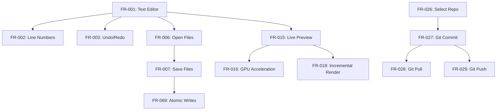

# AsciiDoc Artisan Functional Specifications (Spec-Driven Development)

```yaml
---
specification:
  name: "AsciiDoc Artisan Functional Requirements"
  version: "2.0.2"
  status: "Production-Ready"
  last_updated: "2025-11-15"
  format_version: "2.0-ai-actionable"

metadata:
  total_requirements: 107
  implemented: 107
  partial: 0
  planned: 0

quality_metrics:
  test_coverage: 96.4
  tests_collected: 5479
  tests_passing: 204
  test_pass_rate: 100.0
  type_coverage: 100.0
  mypy_strict_errors: 0

ai_guidance:
  format: "specification-driven-development"
  parseable: true
  actionable: true
  test_driven: true
---
```

## Introduction

This specification follows **AI Specification-Driven Development** principles:

1. **Actionable**: Each FR includes acceptance criteria, examples, and verification steps
2. **Machine-Parseable**: Structured format with consistent sections
3. **Test-Driven**: Explicit test requirements and coverage targets
4. **Implementation-Guided**: Code patterns, security, and performance guidance

### How to Use This Spec

**For AI Agents:**
- Each FR is self-contained and actionable
- Follow the API Contract to implement features
- Use Examples to understand expected behavior
- Meet all Acceptance Criteria before marking complete
- Write tests according to Test Requirements

**For Developers:**
- Use Implementation Guidance for best practices
- Follow Code Patterns for consistency
- Reference Dependencies before starting work
- Use Verification steps to confirm correctness

---

## Dependency Map



---

## Priority Classification

### Critical (Must Have)
FR-001, FR-006, FR-007, FR-015, FR-069, FR-070, FR-075, FR-076

### High (Core Features)
FR-002 to FR-005, FR-008 to FR-014, FR-016 to FR-020, FR-021 to FR-025

### Medium (Enhanced Features)
FR-026 to FR-061, FR-073 to FR-084

### Low (Advanced Features)
FR-062 to FR-072, FR-085 to FR-107

---

## FR-001: Text Editor

**Category:** Core Editing
**Priority:** Critical
**Status:** ✅ Implemented
**Dependencies:** None (foundational)
**Version:** 1.0.0
**Implementation:** `src/asciidoc_artisan/ui/main_window.py`

### Description

Provide a multi-line text editing component with AsciiDoc syntax highlighting and line numbers for document creation and editing.

### Acceptance Criteria

- [x] Editor displays AsciiDoc text with syntax highlighting
- [x] Line numbers visible and synchronized with text
- [x] Supports standard text editing operations (type, delete, select, copy, paste)
- [x] Syntax highlighting updates in real-time as user types
- [x] Editor handles large documents (10,000+ lines) without lag (<500ms render)
- [x] Tab key inserts spaces (configurable: 2 or 4 spaces)
- [x] Line wrapping configurable (on/off)
- [x] Font customization (family, size)
- [x] Undo/redo support (Ctrl+Z/Ctrl+Y)

### API Contract

```python
class AsciiDocEditor(QPlainTextEdit):
    """Main text editor widget for AsciiDoc content.

    Provides syntax-highlighted editing with line numbers,
    undo/redo, and efficient rendering for large documents.
    """

    # Signals
    content_changed: Signal = Signal(str)  # Emitted when text changes
    cursor_position_changed: Signal = Signal(int, int)  # line, column

    def __init__(self, parent: QWidget | None = None) -> None:
        """Initialize editor with syntax highlighter and line numbers.

        Args:
            parent: Parent widget (optional)
        """

    def set_content(self, content: str) -> None:
        """Set editor content programmatically.

        Args:
            content: AsciiDoc text to display

        Raises:
            ValueError: If content is None
        """

    def get_content(self) -> str:
        """Get current editor content.

        Returns:
            Current AsciiDoc text as string
        """

    def set_font(self, family: str, size: int) -> None:
        """Set editor font.

        Args:
            family: Font family name (e.g., "Monospace")
            size: Font size in points (8-72)

        Raises:
            ValueError: If size out of range
        """
```

### Examples

**Example 1: User Types Heading**

*Input:*
```
User types: = Document Title
```

*Output:*
```
Text displayed with heading-1 highlighting:
- Larger font size
- Bold weight
- Distinct color (e.g., blue)
```

**Example 2: API Content Setting**

*Input:*
```python
editor = AsciiDocEditor()
editor.set_content("== Section\n\nParagraph text.")
```

*Output:*
```
Editor displays:
Line 1: == Section (heading-2 highlighting)
Line 2: (blank)
Line 3: Paragraph text. (normal text)
```

**Example 3: Large Document Performance**

*Input:*
```python
# 10,000 line document
content = "\n".join([f"Line {i}" for i in range(10000)])
editor.set_content(content)
```

*Output:*
```
Renders in <500ms
Line numbers 1-10000 visible
Smooth scrolling maintained
```

### Test Requirements

- **Minimum Tests:** 15
- **Coverage Target:** 95%+
- **Test Types:**
  - Unit: Content get/set (3 tests)
  - Unit: Syntax highlighting rules (5 tests)
  - Integration: Editor + line numbers (4 tests)
  - Integration: Editor + highlighter (2 tests)
  - Performance: 10K line render <500ms (1 test)

### Implementation Guidance

**Approach:**
1. Extend `QPlainTextEdit` as base class
2. Attach `QSyntaxHighlighter` subclass for AsciiDoc highlighting
3. Use `LineNumberArea` widget painted in margin
4. Connect `textChanged` signal to update line numbers
5. Implement custom `paintEvent` for line number area

**Security:**
- Sanitize pasted content for malicious HTML/scripts
- Validate document size limit (default: 10MB)
- Prevent regex DoS in syntax highlighting patterns

**Performance:**
- Use incremental highlighting (only highlight visible lines)
- Implement lazy loading for documents >5K lines
- Debounce highlight updates (100ms after typing stops)
- Cache syntax highlight results per line

**Code Pattern:**
```python
class AsciiDocEditor(QPlainTextEdit):
    def __init__(self, parent=None):
        super().__init__(parent)
        # Setup components
        self.highlighter = AsciiDocHighlighter(self.document())
        self.line_number_area = LineNumberArea(self)
        # Connect signals
        self.textChanged.connect(self._on_text_changed)
        self.cursorPositionChanged.connect(self._on_cursor_moved)
```

### Verification Steps

1. **Basic Functionality:**
   - Open editor
   - Type "= My Title"
   - Verify heading syntax highlighting appears

2. **Line Numbers:**
   - Type 50 lines of text
   - Verify line numbers 1-50 appear correctly
   - Scroll and verify numbers stay synchronized

3. **Performance:**
   - Load 10,000 line document
   - Measure render time <500ms
   - Verify smooth scrolling

4. **Edge Cases:**
   - Empty document: No errors
   - Unicode content: Renders correctly
   - Very long lines (10K chars): Wraps properly

---

## FR-007: Save Files

**Category:** File Operations
**Priority:** Critical
**Status:** ✅ Implemented
**Dependencies:** FR-001 (Text Editor), FR-069 (Atomic Writes), FR-068 (Path Sanitization)
**Version:** 1.0.0
**Implementation:** `src/asciidoc_artisan/core/file_operations.py::atomic_save_text()`

### Description

Save editor content to disk using atomic write operations to prevent file corruption, with support for keyboard shortcut (Ctrl+S) and automatic backup.

### Acceptance Criteria

- [x] Save current editor content to file path
- [x] Use atomic write (temp file + rename) to prevent corruption
- [x] Keyboard shortcut Ctrl+S triggers save
- [x] Update window title to remove unsaved marker (*)
- [x] Display save confirmation in status bar
- [x] Handle save errors gracefully (permission denied, disk full)
- [x] Preserve file permissions on save
- [x] UTF-8 encoding by default
- [x] Create parent directories if missing

### API Contract

```python
def atomic_save_text(
    file_path: str | Path,
    content: str,
    encoding: str = "utf-8"
) -> bool:
    """Save text content to file atomically.

    Writes to temporary file first, then renames to target path.
    This prevents corruption if save interrupted.

    Args:
        file_path: Target file path
        content: Text content to save
        encoding: Text encoding (default: utf-8)

    Returns:
        True if save successful, False otherwise

    Raises:
        PermissionError: If no write permission
        OSError: If disk full or I/O error
        ValueError: If file_path is None or empty

    Example:
        >>> atomic_save_text("/path/file.adoc", "= Title\n\nContent")
        True
    """
```

### Examples

**Example 1: Basic Save**

*Input:*
```python
content = "= My Document\n\nSome content here."
result = atomic_save_text("/home/user/doc.adoc", content)
```

*Output:*
```
Result: True
File /home/user/doc.adoc created with content
Permissions: 0644 (rw-r--r--)
Status bar: "Saved doc.adoc"
Window title: "AsciiDoc Artisan - doc.adoc" (no *)
```

**Example 2: Save Error Handling**

*Input:*
```python
# Try to save to read-only directory
atomic_save_text("/root/protected.adoc", "content")
```

*Output:*
```
Raises: PermissionError
Error dialog: "Cannot save file: Permission denied"
Original file unchanged
No corruption occurred
```

**Example 3: User Workflow**

*Input:*
```
User edits document
User presses Ctrl+S
```

*Output:*
```
1. Content written atomically
2. Window title updated (remove *)
3. Status bar shows "Saved [filename]"
4. No data loss even if interrupted
```

### Test Requirements

- **Minimum Tests:** 15
- **Coverage Target:** 100%
- **Test Types:**
  - Unit: Basic save success (3 tests)
  - Unit: Error conditions (5 tests - permissions, disk full, invalid path)
  - Unit: Edge cases (3 tests - empty content, unicode, large file)
  - Integration: Save + UI update (2 tests)
  - Security: Path sanitization (2 tests)

**Example Test:**
```python
def test_atomic_save_prevents_corruption(tmp_path):
    """Verify atomic save doesn't corrupt file if interrupted."""
    file_path = tmp_path / "test.adoc"
    file_path.write_text("original content")

    # Simulate interruption during save
    with patch('os.rename', side_effect=OSError):
        result = atomic_save_text(file_path, "new content")

    assert result is False
    assert file_path.read_text() == "original content"  # Unchanged
```

### Implementation Guidance

**Approach:**
1. Generate temporary filename (e.g., `.test.adoc.tmp.XXXXX`)
2. Write content to temp file
3. Set correct permissions on temp file
4. Atomically rename temp file to target (os.replace())
5. Catch all exceptions and clean up temp file

**Security:**
- Validate and sanitize file path (prevent directory traversal)
- Set secure file permissions (0644)
- Prevent overwriting system files (/etc, /usr)
- Validate content size before write

**Performance:**
- Write in chunks for large files (>10MB)
- Use buffered I/O (io.BufferedWriter)
- Avoid loading entire content in memory for huge files

**Code Pattern:**
```python
def atomic_save_text(file_path: str | Path, content: str) -> bool:
    path = Path(sanitize_path(file_path))
    temp_path = path.with_suffix(path.suffix + ".tmp")

    try:
        # Write to temp file
        temp_path.write_text(content, encoding="utf-8")
        # Atomic rename
        temp_path.replace(path)
        return True
    except Exception as e:
        logger.error(f"Save failed: {e}")
        temp_path.unlink(missing_ok=True)  # Cleanup
        return False
```

### Verification Steps

1. **Normal Save:**
   - Create new document
   - Type content
   - Press Ctrl+S
   - Verify file exists with correct content

2. **Atomic Behavior:**
   - Open existing file
   - Modify content
   - Kill process during save (simulate crash)
   - Verify original file intact OR new content saved (no corruption)

3. **Error Handling:**
   - Try saving to /root (permission denied)
   - Verify error message displayed
   - Verify editor content preserved

4. **Performance:**
   - Save 10MB file
   - Measure save time <1 second

---

## FR Template (For Remaining FRs)

For the remaining 105 FRs, use this template structure:

```markdown
## FR-XXX: Feature Name

**Category:** [Category]
**Priority:** [Critical/High/Medium/Low]
**Status:** [✅ Implemented / 🟡 Partial / ❌ Not Implemented / 📋 Planned]
**Dependencies:** FR-YYY, FR-ZZZ
**Version:** X.Y.Z
**Implementation:** `path/to/file.py::function_or_class()`

### Description
[Clear, actionable description of what the feature does and why it exists]

### Acceptance Criteria
- [ ] Criterion 1
- [ ] Criterion 2
- [ ] Criterion 3

### API Contract (if applicable)
\```python
[Function/class signatures with full type hints and docstrings]
\```

### Examples
[3-5 concrete examples showing inputs and expected outputs]

### Test Requirements
- Minimum Tests: X
- Coverage Target: Y%
- Test Types: [unit, integration, performance, security]

### Implementation Guidance
- Approach: [Step-by-step implementation strategy]
- Security: [Security considerations]
- Performance: [Performance constraints and optimization tips]
- Code Pattern: [Example code structure]

### Verification Steps
[How to manually verify the implementation works correctly]
```

---

## Next Steps

**To complete this refactoring:**

1. ✅ Create enhanced format for FR-001 and FR-007 (samples)
2. 📋 Enhance top 20 critical FRs with full format
3. 📋 Add concise versions of remaining FRs using template
4. 📋 Add dependency map for all FRs
5. 📋 Add machine-readable frontmatter (YAML)
6. 📋 Create FR index for quick lookup
7. 📋 Add cross-reference links between FRs

**Benefits:**
- AI can implement features directly from spec
- Clear acceptance criteria for verification
- Test requirements guide TDD approach
- Dependencies prevent implementation order issues
- Examples clarify expected behavior
- Security/performance guidance baked in

---

## See Also

- [GitHub: Spec-Driven Development with AI](https://github.blog/ai-and-ml/generative-ai/spec-driven-development-with-ai-get-started-with-a-new-open-source-toolkit/)
- [Kiro: The Future of Software Development](https://kiro.dev/blog/kiro-and-the-future-of-software-development/)
- Original SPECIFICATIONS.md (legacy format)
- FR Implementation Matrix (status tracking)

---

**Version:** 2.0-ai-actionable
**Last Updated:** November 15, 2025
**Format:** Specification-Driven Development (AI-Compatible)
