# AsciiDoc Artisan Architecture

**v2.1.0** | **Dec 5, 2025** | **Public Release**

---

## Quick Reference

| Metric | Value |
|--------|-------|
| Source files | 180 |
| Source lines | 46,457 |
| Unit tests | 5,628 |
| E2E tests | 17 |
| Integration tests | 17 |
| Test coverage | 95% |
| Type coverage | 100% (mypy --strict) |
| Startup time | 0.27s |
| Storage format | TOON (30-60% smaller than JSON) |

---

## Design Principles

**MA Principle (間)** — Each module does one thing. Target: <400 lines per file.

**Handler Pattern** — UI logic lives in focused handler classes. MainWindow delegates.

**Thread Safety** — Slow operations run in QThread workers. UI updates via signals.

**Atomic Writes** — File saves use temp+rename. No partial writes on crash.

---

## Package Structure

```
src/asciidoc_artisan/
├── core/        13,085 lines   Business logic, no Qt UI
├── ui/          22,794 lines   Qt widgets and handlers
├── workers/      5,915 lines   QThread background workers
├── lsp/          2,134 lines   Language Server Protocol
├── claude/         658 lines   Claude AI integration
└── templates/                  Built-in document templates
```

### Component Diagram

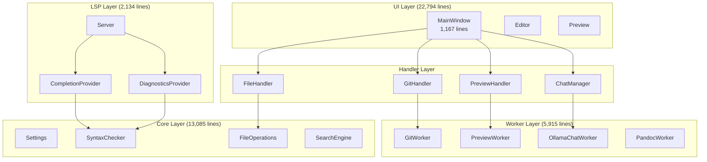

---

## Core Package

Business logic. No Qt dependencies except models.

```
core/
├── settings.py           # App configuration
├── toon_utils.py         # TOON format serialization
├── file_operations.py    # Atomic file I/O (text, JSON, TOON)
├── search_engine.py      # Find & replace
├── spell_checker.py      # Spell validation
├── syntax_checker.py     # AsciiDoc validation
├── template_engine.py    # Template processing
├── gpu_detection.py      # Hardware detection
├── gpu_cache.py          # GPU cache (TOON format)
├── secure_credentials.py # OS keyring storage
│
├── *_models.py           # Pydantic data models
│   ├── git_models.py     # GitResult, GitStatus
│   ├── chat_models.py    # ChatMessage
│   ├── syntax_models.py  # SyntaxErrorModel, QuickFix
│   └── completion_models.py  # CompletionItem
│
└── *_rules.py            # Validation rules
    ├── syntax_error_rules.py
    ├── warning_rules.py
    └── info_rules.py
```

### Data Models

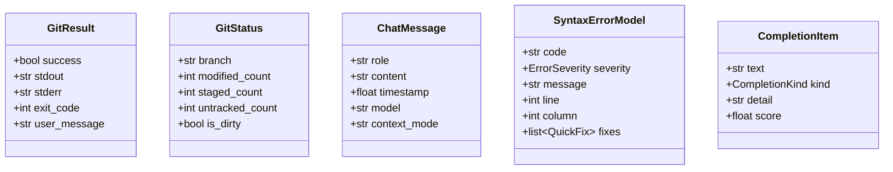

---

## UI Package

Qt widgets and handlers. MainWindow is the coordinator.

```
ui/
├── main_window.py        # App controller (1,167 lines)
│
├── *_handler.py          # Domain handlers
│   ├── file_handler.py       # File operations
│   ├── file_open_handler.py  # Open dialogs
│   ├── file_save_handler.py  # Save dialogs
│   ├── git_handler.py        # Git operations
│   ├── github_handler.py     # GitHub CLI
│   ├── preview_handler.py    # Preview coordination
│   ├── preview_handler_base.py  # Preview base class
│   ├── preview_handler_gpu.py   # GPU rendering
│   └── search_handler.py     # Find & replace
│
├── *_manager.py          # Feature managers
│   ├── chat_manager.py       # AI chat (441 lines)
│   ├── action_manager.py     # QAction factory
│   ├── worker_manager.py     # Worker lifecycle
│   └── syntax_checker_manager.py  # Validation UI
│
├── *_widget.py           # UI components
│   ├── chat_bar_widget.py    # Chat input
│   ├── chat_panel_widget.py  # Chat display
│   ├── find_bar_widget.py    # Search bar
│   └── quick_commit_widget.py # Git commit
│
└── *_dialog.py           # Dialog windows
```

### Handler Hierarchy

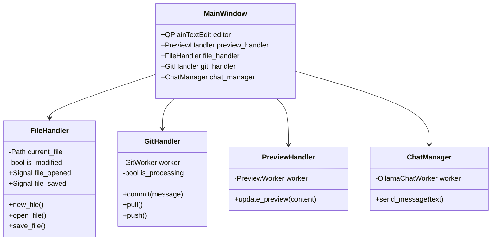

---

## Workers Package

QThread workers for background operations.

```
workers/
├── base_worker.py         # Shared worker logic
├── git_worker.py          # Git commands
├── github_cli_worker.py   # GitHub CLI
├── pandoc_worker.py       # Format conversion
├── preview_worker.py      # AsciiDoc rendering
├── ollama_chat_worker.py  # AI chat
│
├── Rendering
│   ├── incremental_renderer.py    # Block caching
│   ├── parallel_block_renderer.py # Multi-core
│   ├── predictive_renderer.py     # Prefetch
│   ├── block_splitter.py          # Document parsing
│   └── render_cache.py            # LRU cache
│
└── Helpers
    ├── git_command_executor.py
    ├── git_status_parser.py
    ├── git_error_handler.py
    └── pandoc_executor.py
```

### Worker Class Hierarchy

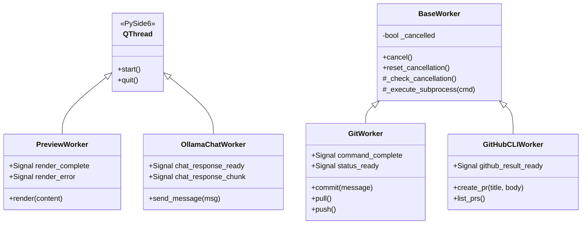

---

## LSP Package

Language Server Protocol for editor integration.

```
lsp/
├── server.py              # LSP server core
├── document_state.py      # Thread-safe doc storage
├── completion_provider.py # Auto-complete
├── diagnostics_provider.py # Syntax errors
├── hover_provider.py      # Documentation
├── symbols_provider.py    # Document outline
├── code_action_provider.py # Quick fixes
├── folding_provider.py    # Code folding
├── formatting_provider.py # Document format
└── semantic_tokens_provider.py # Highlighting
```

### LSP Architecture

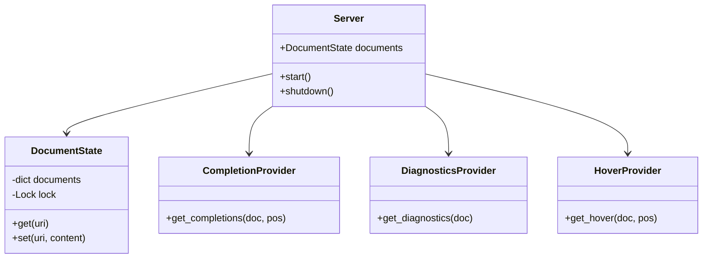

---

## Threading Model

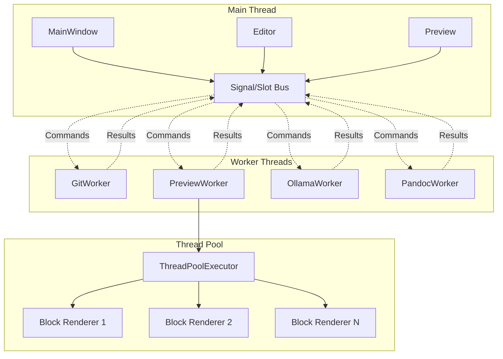

### Worker Pattern

```python
class Worker(QThread):
    result_ready = Signal(Result)

    def __init__(self):
        super().__init__()
        self._cancelled = False

    def run(self):
        while not self._cancelled:
            cmd = self._queue.get()
            if cmd is None:
                break
            result = self._process(cmd)
            self.result_ready.emit(result)

    def cancel(self):
        self._cancelled = True
```

### Reentrancy Guard

```python
def start_operation(self):
    if self._is_processing:
        return  # Already running
    self._is_processing = True
    try:
        self.worker.start()
    finally:
        self._is_processing = False
```

---

## Key Workflows

### Document Edit Flow

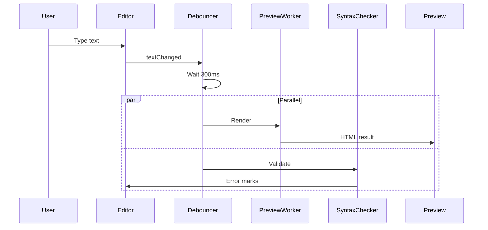

### Git Commit Flow

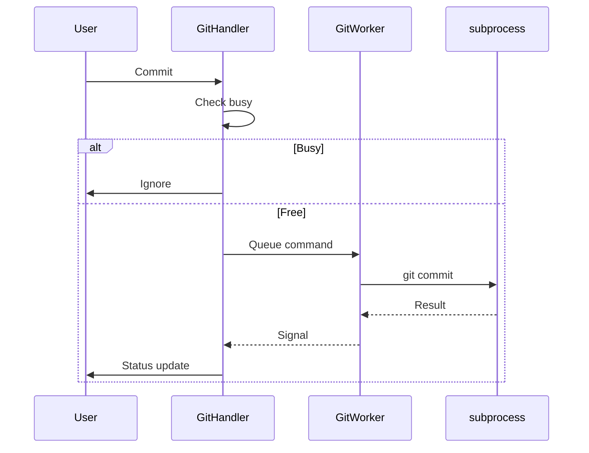

### Atomic File Save

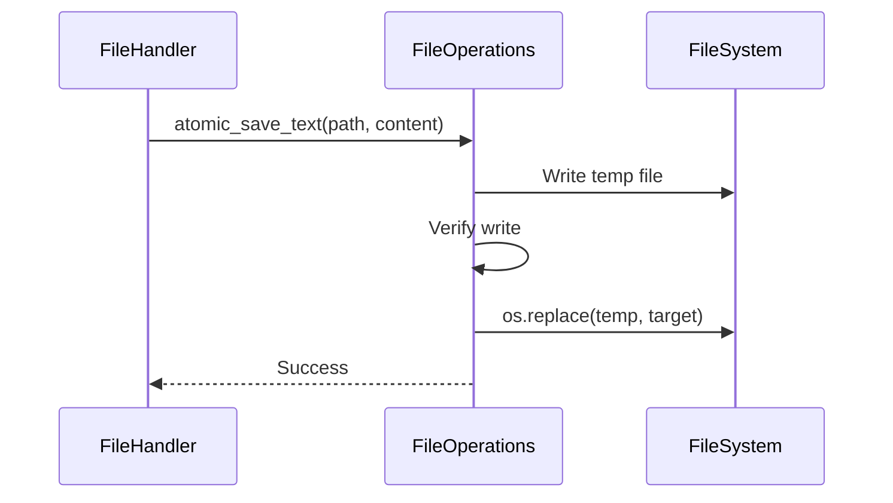

### AI Chat Flow

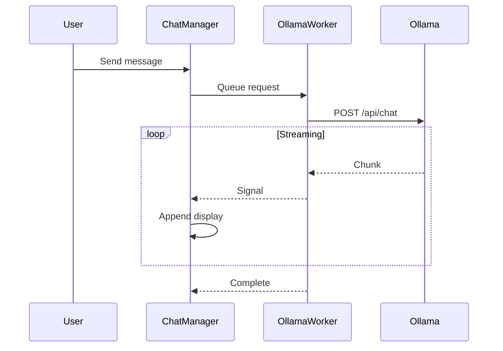

---

## State Machines

### Application State

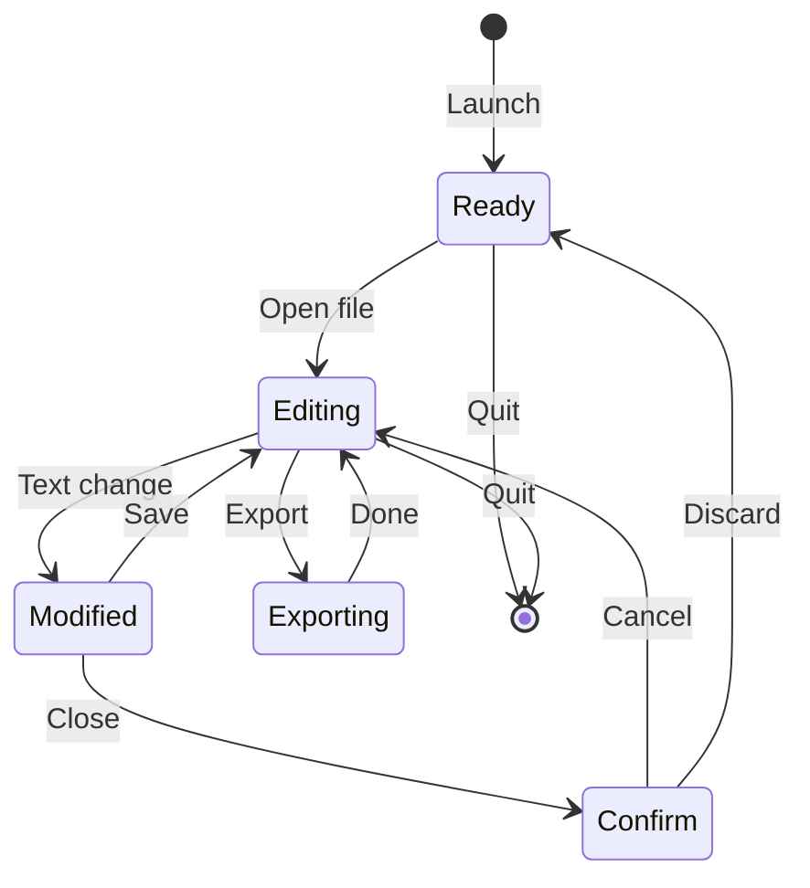

### Git Operation State

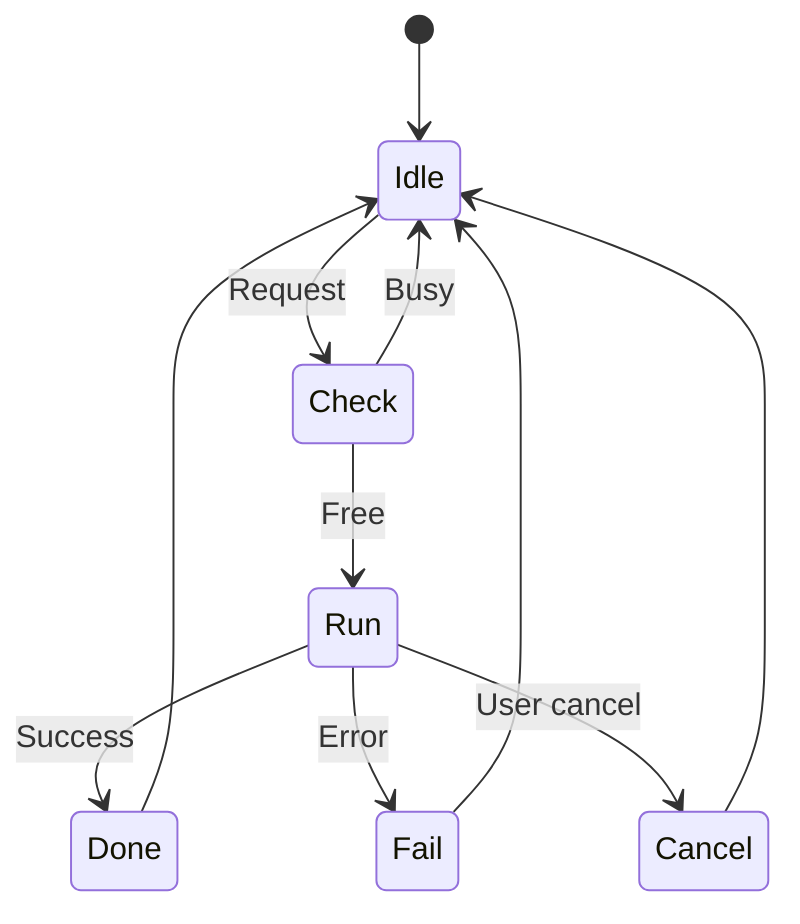

### Preview State

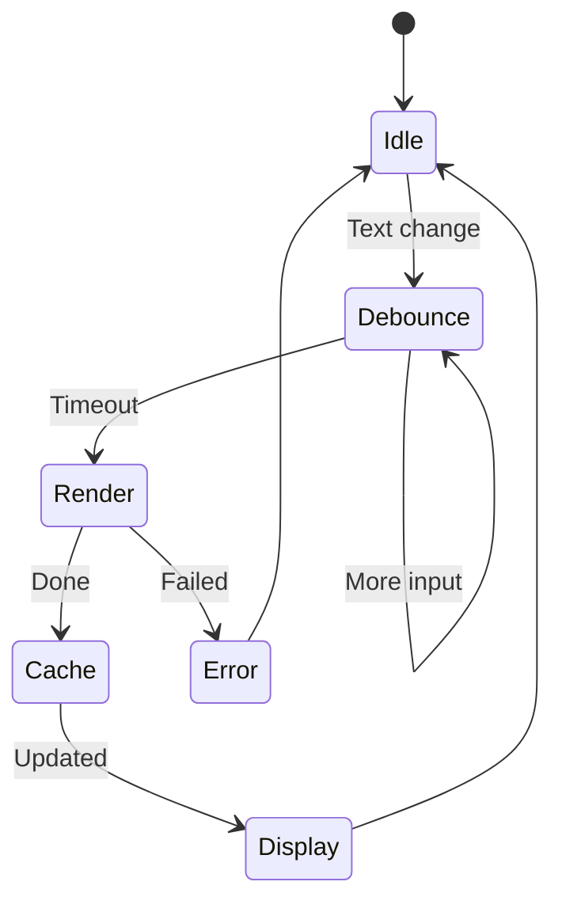

---

## Security

### Subprocess Execution

```python
# CORRECT: List prevents injection
subprocess.run(["git", "commit", "-m", message], shell=False)

# WRONG: Shell is vulnerable
subprocess.run(f"git commit -m '{message}'", shell=True)  # NEVER
```

### Atomic Writes

```python
# CORRECT: Temp + rename
from asciidoc_artisan.core import atomic_save_text
atomic_save_text(path, content)

# WRONG: Direct write corrupts on crash
with open(path, 'w') as f:
    f.write(content)  # AVOID
```

### Credentials

```python
# CORRECT: OS keyring
from asciidoc_artisan.core import SecureCredentials
creds = SecureCredentials()
creds.store_api_key("claude", key)

# WRONG: Plain text
config["api_key"] = key  # NEVER
```

---

## Performance

| Operation | Target | Actual |
|-----------|--------|--------|
| Startup | <1.0s | 0.27s |
| Preview | <200ms | <100ms |
| Autocomplete | <50ms | 20-40ms |
| Syntax check | <100ms | <50ms |
| File open | <500ms | <200ms |

### Multi-Core Rendering

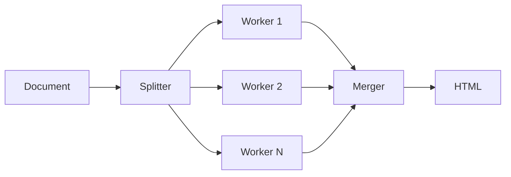

- Thread-local AsciiDoc instances
- Block-based parallelization
- 2-4x speedup on multi-core
- Graceful single-core fallback

### GPU Rendering

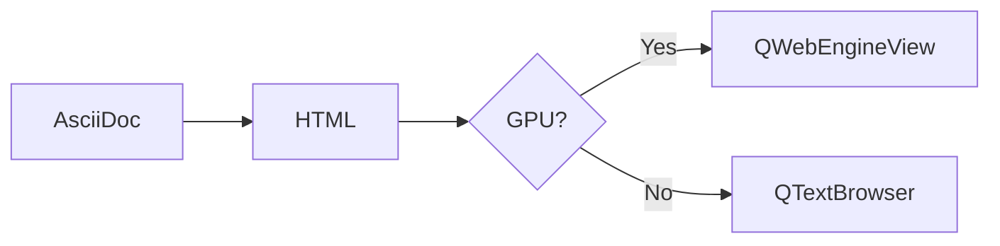

Detection cached 7 days at `~/.config/AsciiDocArtisan/gpu_cache.toon`

---

## Extension Points

### Add a Worker

1. Create `workers/new_worker.py`
2. Define signals
3. Implement `run()`
4. Export in `workers/__init__.py`
5. Initialize in MainWindow
6. Connect signals

### Add an LSP Feature

1. Create `lsp/new_provider.py`
2. Implement provider method
3. Register handler in `server.py`
4. Add tests

### Add a Handler

1. Create `ui/new_handler.py`
2. Implement methods
3. Initialize in MainWindow
4. Delegate from UI

---

## FR Mapping

| Category | FRs | Location |
|----------|-----|----------|
| Editor | FR-001–005 | `ui/main_window.py` |
| Files | FR-006–014 | `core/file_operations.py`, `ui/file_handler.py` |
| Preview | FR-015–020 | `workers/preview_worker.py`, `ui/preview_handler*.py` |
| Export | FR-021–025 | `workers/pandoc_worker.py` |
| Git | FR-026–033 | `workers/git_worker.py`, `ui/git_handler.py` |
| GitHub | FR-034–038 | `workers/github_cli_worker.py` |
| AI | FR-039–044 | `workers/ollama_chat_worker.py`, `ui/chat_manager.py` |
| Search | FR-045–049 | `core/search_engine.py` |
| Spell | FR-050–054 | `core/spell_checker.py` |
| Autocomplete | FR-085–090 | `lsp/completion_provider.py` |
| Syntax | FR-091–099 | `core/syntax_checker.py`, `lsp/diagnostics_provider.py` |
| Templates | FR-100–107 | `core/template_engine.py` |
| LSP | FR-109 | `lsp/*.py` |

---

## Related Docs

- [SPECIFICATIONS.md](../SPECIFICATIONS.md) — 109 FRs with schemas
- [ROADMAP.md](../ROADMAP.md) — Version history

---

*v2.1.0 | 180 files | 46,457 lines | 95% coverage | TOON format | MA Principle*
